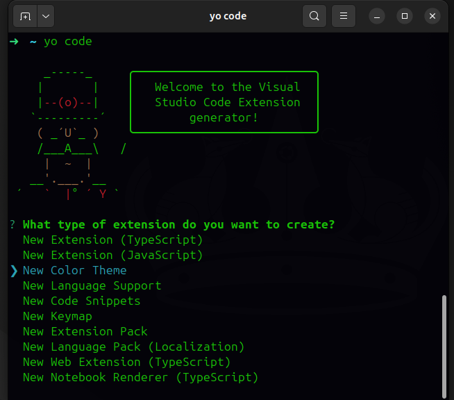
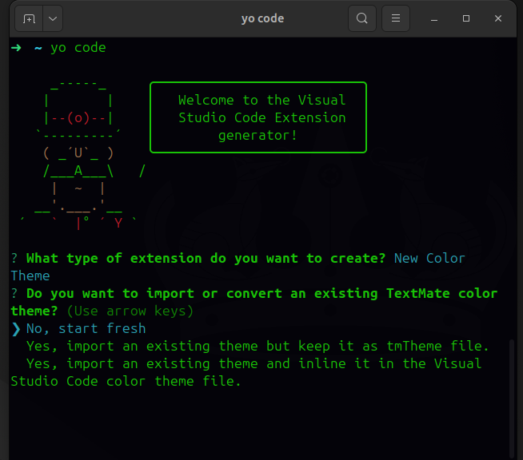
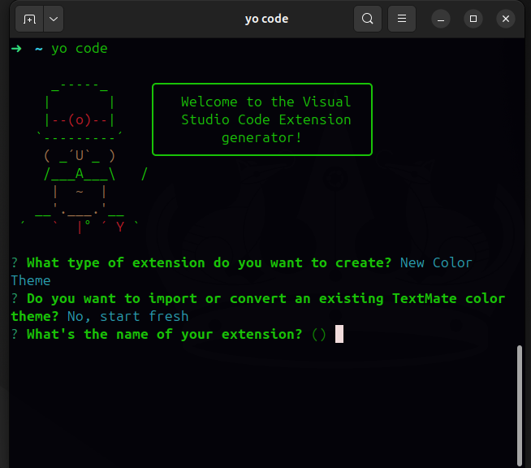
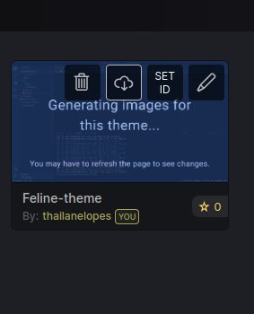
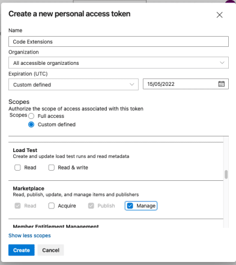

  

<h2 align="center">feline-color-theme</h2>

# Documentação

Este é o meu próprio tema VSCode.

# Como o desenvolvi:

#### 1 - Cadastre-se nos serviços:

- Teme Studio (https://themes.vscode.one/)

- Azure DevOps (https://azure.microsoft.com/pt-br/products/devops/?nav=min)

- Visual Studio Marketplace

#### 2 - Preparando o ambiente

- Para gerar o projeto base:

npm install -g yo generator-code

- Ferramenta para publicar o tema no Visual Studio Marketplace

npm install -g vsce

#### 3 - Criando o tema base

- utilizaremos a ferramenta generator-code para criar toda a estrutura base do tema

yo code

- Selecione New Color Theme

- Depois escolha No, start fresh

- Depois configure as informações do Seu tema

#### 3 - Customizando as cores

- Acesse o serviço Theme Studio, faça login e clique em Create new Theme.

- Nomeie seu tema

- Estilize seu tema e salve

#### 3 - Publicando o tema

- Clique em Your Themes, passe o mouse sobre o tema que foi criado e clique no botão de download:

- Abra a pasta do tema base no vscode e substitua o conteúdo do arquivo themes/color-theme.json pelo conteúdo do arquivo json que foi baixado. Para testar o tema antes de publicar pressione F5, isso iniciará o debug e abrirá uma nova janela do vscode com o tema aplicado.

- No Azure DevOps, clique no ícone de usuário e acesse a opção personal access token.

- Clique em New Token e preencha o formulário.

- Ao clicar em create será gerado um novo token. Copie este token e salve em um lugar seguro, pois não será exibido novamente

- Agora vá para o terminal, acesse o diretório do tema e execute o comando abaixo:
  
  vsce login publisher name
      
-  Publisher Name é o seu Publisher ID que foi gerado no passo 0. Ao executar este comando o vsce pedirá o seu token, copie e cole o token que foi gerado no Azure DevOps.

-    Em seguida execute o comando abaixo:
  
  vsce publish

Pronto!!!
